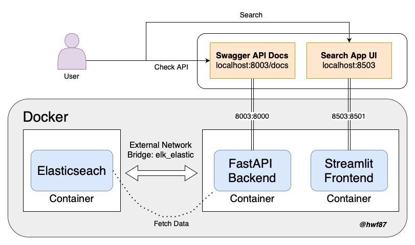
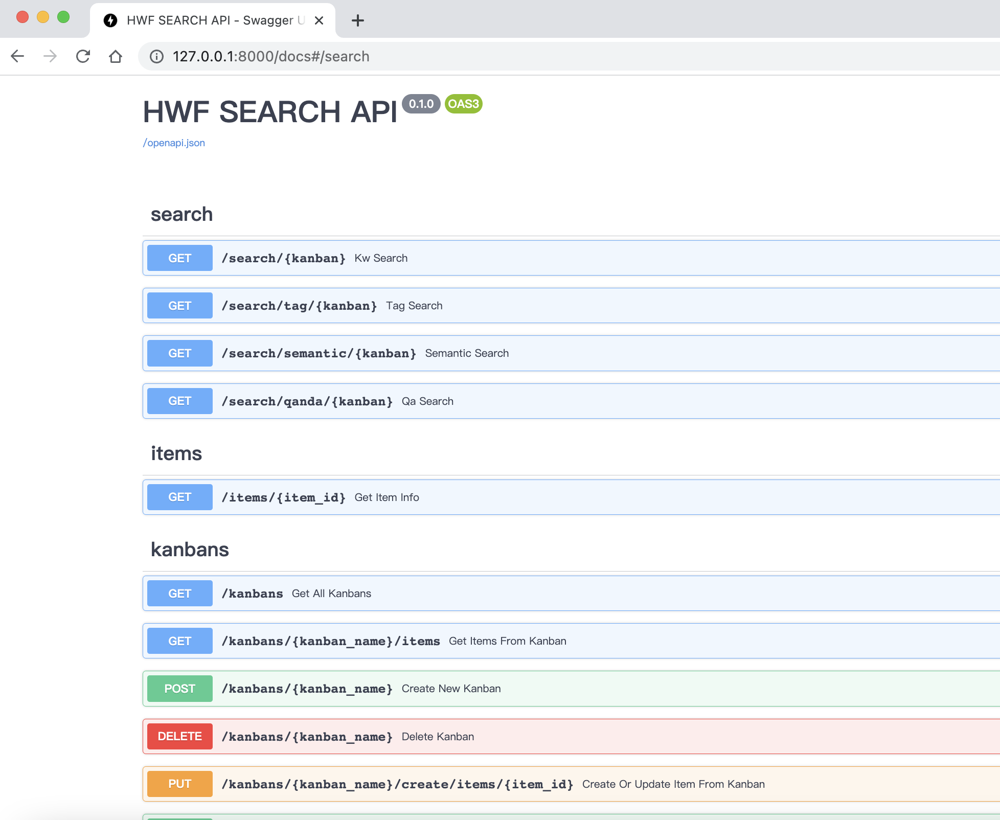
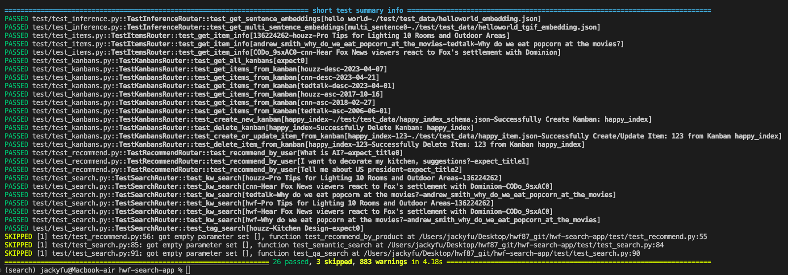
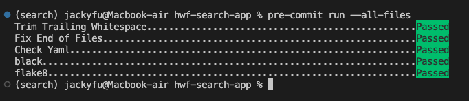

# hwf-search-app


This is a project that using Streamlit for the frontend and FastAPI for the backend to build a series of search, recommendation, filtering features. Automated testing and deployment are completed through Pytest and Github Action.

## Medium Blogs
[[Data Engineering] Build a search App with FastAPI + Elasticsearch + Streamlit](https://jackyfu1995.medium.com)

## Architecture Overview


## DEMO
[](https://vimeo.com/823397030)

## How to Start
1. git clone https://github.com/hwf87/hwf-search-app.git

2. Create a .env file with following configs
```
ES_ALIAS="hwf"
ES_USERNAME="elastic"
ES_PASSWORD="elastic"
ES_HOST="es-container:9200"
```

3. Build Elasticsearch & Kibana Service (SKIP if you already have one)
> visit http://127.0.0.1:9200 for elasticsearch

> visit http://127.0.0.1:5601 for kibana

> check docker container by 'docker ps'

> check elk_elastic network exists by 'docker network ls'
```
cd ./elk
docker-compose -f docker-compose-elk.yaml up -d
docker ps
docker network ls
```

4. Data Ingestion
> We provide 2 options for preparing dataset
- Option 1: Clone the ETL repo and Follow its RERADME to prepare data
```
# Follow the Readme step, it will ingest over 20,000 documents for you
git clone https://github.com/hwf87/hwf-search-etl.git
```

- Option 2: Just create a small mock dataset with following commands
```
# prepare local develop env
conda create -n search_engine python=3.8
conda activate search_engine
cd ./hwf-search-app
pip install -r requirements.txt

# Create small dataset (72 documents will be created)
# Note that you need to modified ES_HOST in .env if you are running code locally
# ES_HOST="127.0.0.1:9200"
bash create_mock_es_data.sh
```

5. Build search app
> visit http://127.0.0.1:8003/docs for FastApi documentations

> visit http://127.0.0.1:8503/ for Streamlit App
```
cd ./hwf-seaarch-app
docker compose up
```

6. Enjoy the search app
- Backend: FastApi


- Frontend: Streamlit


## How to run without docker for Debuging
1. Set environment variaables
> Remember to change ES_HOST=http://127.0.0.1:9200 in .env file

2. Create new env for developing
```
conda create -n search_engine python=3.8
conda activate search_engine
cd ./hwf-search-app
pip install -r requirements.txt
```

3. Start FastApi Backend
> Note that .env file is for FastApi backend to use
```
python ./app/main.py
```

3. Start Streamlit Frontend
> Note that you can set .streamlit/config.toml for server & port numbers
```
cd ./frontend
streamlit run HOME.py
# streamlit run HOME.py --server.port 8501 --server.serverAddress='0.0.0.0'
```


## Unit Test
```
# Note that you need to modified ES_HOST in .env if you are running code locally
# ES_HOST="127.0.0.1:9200"
bash unit_test.sh
```
- PyTest Screenshot



## Precommit
- Black config: find ```pyproject.toml```
- Flake8 config: find ```tox.ini```
```
repos:
-   repo: https://github.com/pre-commit/pre-commit-hooks
    rev: v3.2.0
    hooks:
    -   id: trailing-whitespace
    -   id: end-of-file-fixer
    -   id: check-yaml
    -   id: check-added-large-files
-   repo: https://github.com/psf/black
    rev: 22.10.0
    hooks:
    -   id: black
        name: black
-   repo: https://github.com/PyCQA/flake8
    rev: 6.0.0
    hooks:
    -   id: flake8
```
- Precommit Screenshot



## CI/CD
- Githun Actions
- Find ```github-actions.yml```
```
[JOB 1] Build
- steps
    - Set up Python
    - Install dependencies
    - Pre-Commit Check
    - Build images
[JOB 2] Deploy
- steps
    - skip
```
